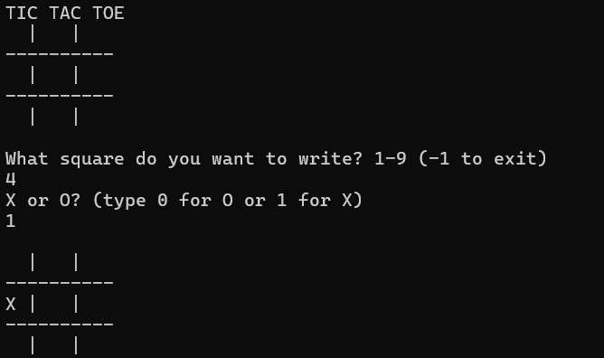
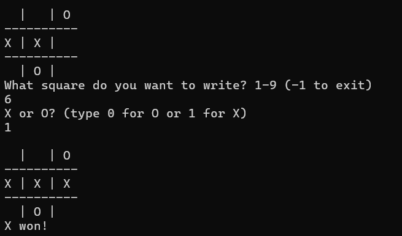

# Terminal Tic-Tac-Toe

A classic, lightweight Tic-Tac-Toe game playable entirely within the terminal. Two players can take turns claiming spaces on a 3x3 grid until a winner is crowned or the game ends in a draw.

This project showcases foundational C++ logic, including 2D array manipulation, memory-efficient pass-by-reference functions, and game loop state management.

## 🎮 Gameplay Features
* **Interactive Grid:** A classic 3x3 board updated dynamically in the console.
* **Input Validation:** Prevents players from overwriting already claimed squares or entering out-of-bounds coordinates.
* **Algorithmic Win Detection:** Automatically checks rows, columns, and diagonals for a winning match of 'X's or 'O's after every turn.
* **Draw Detection:** Recognizes when the board is full with no winner and ends the game gracefully.

## 🛠️ Tech Stack & Concepts
* **Language:** C++
* **Data Structures:** 2D arrays (`int TicToe[3][3]`) for board state tracking.
* **Memory Management:** Passing multi-dimensional arrays by reference to functions.
* **Control Flow:** Nested `do-while` loops for continuous game state execution and input handling.

## 🚀 How to Build and Run

### Linux / macOS (g++)
To compile and run the game using the `g++` compiler from your terminal:
1. Clone the repository: `git clone https://github.com/YourUsername/YourRepoName.git`
2. Navigate to the directory: `cd YourRepoName`
3. Compile the code: `g++ TicTacToe.cpp -o tictactoe`
4. Run the executable: `./tictactoe`

### Windows (Visual Studio / MSVC)
1. Clone the repository and open the folder in Visual Studio.
2. Ensure your build configuration is set to `Debug` or `Release` (x64).
3. Build the solution (`Ctrl + Shift + B`).
4. Run the program without debugging (`Ctrl + F5`).

## 📸 Preview

